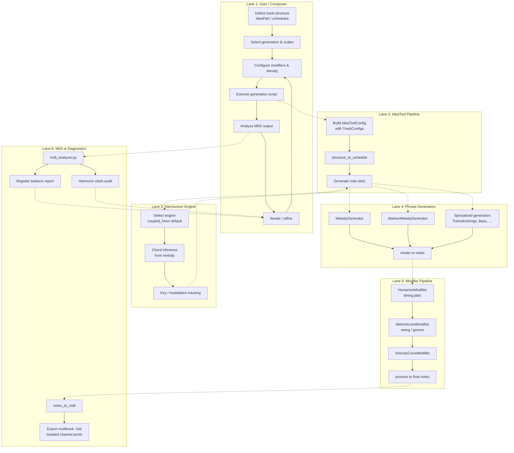
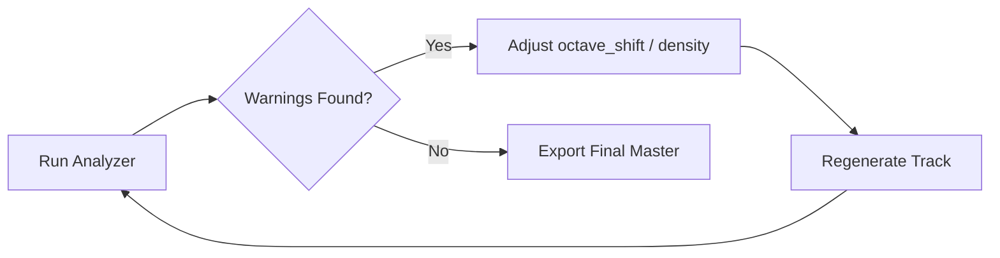

# 🎵 Melodica

[](https://pypi.org/project/melodica/)
[](https://www.python.org/)
[](LICENSE)
[](https://github.com/astral-sh/ruff)
[](#7-development--testing)

> **Melodica** is a professional Python framework for generative music composition, orchestration, and harmonization. It translates high-level musical ideas into structured multitrack MIDI/Audio arrangements via a decoupled Hexagonal (Ports & Adapters) architecture, offering production-grade composing pipelines, dynamic DSP effects, and advanced acoustic analytics.

---

## 📖 Table of Contents

1. [Features](#1-features)
2. [System Architecture](#2-system-architecture)
   - [Hexagonal Architecture](#hexagonal-architecture)
   - [Unified Harmonization Engines](#unified-harmonization-engines)
   - [MIDI Channel Isolation](#midi-channel-isolation)
3. [Installation](#3-installation)
4. [Quick Start & Workflows](#4-quick-start--workflows)
   - [Basic Harmonization](#basic-harmonization)
   - [Orchestration with IdeaTool](#orchestration-with-ideatool)
   - [Non-Destructive Modifier Pipeline](#non-destructive-modifier-pipeline)
   - [Studio Mastering & DSP Effects](#studio-mastering--dsp-effects)
5. [Process Pipeline (BPMN Map)](#5-process-pipeline-bpmn-map)
6. [Diagnostics & Quality Audits](#6-diagnostics--quality-audits)
   - [MIDI Analyzer & Psychoacoustics](#midi-analyzer--psychoacoustics)
   - [Register Balancing Workflow](#register-balancing-workflow)
7. [Development & Testing](#7-development--testing)
8. [Related Projects](#8-related-projects)

**Annexes**
* [Annex A (Informative): Case Study — Register Balancing](#annex-a-informative-case-study--register-balancing)
* [Annex B (Informative): Project Directory Structure](#annex-b-informative-project-directory-structure)

---

## 1. Features

Melodica implements a complete algorithmic music workstation in code, consisting of several core layers:

* **🧠 Multi-Engine Harmonizer**: Decoupled chord inference from raw melodic vectors. Supported engines include Viterbi rule graphs, adaptive heuristics, and a hierarchical **Coupled HMM** (Key + Chord layers) inspired by modern musical theory.
* **🎹 Specialized Generative Phrase Library**: Over 160+ customizable algorithmic engines generating parts for lead synthesizers, evolving ambient pads, sliding 808 sub-basses, symphonic brass/woodwinds/strings, and modern beat architectures (Trap, Drill, D&B, Lofi).
* **🎼 Song Form & Layout Orchestrator**: Supports high-level form layouts (AABA, Sonata forms, theme variations, imitation canons) mapped through `IdeaTool` tracks. Features pivot/chromatic/dominant key modulations and Circle of Fifths navigation.
* **🎛️ Non-Destructive Modifier Stack**: Chainable real-time modifiers (`ModifierPipeline`) acting as inserts. Modify swing, dynamic crescendos/decrescendos, humanization jitter, smart orchestral divisi, legato pitch bends, and strict voice-leading constraints.
* **🔊 Audio Rendering & DSP Mastering**: Built-in VST3/AU player plugin wrapper (via `pedalboard` and `dawdreamer`), offline mixing desks (gain staging, auto-gain, channel pan faders), and professional mastering processors (LUFS target matching, brickwall limiters, parallel New York compression).
* **📊 Unified MIDI Diagnostic Tool**: Real-time analytical audits of exported MIDI files. Automatically flags harmonic clashes, psychoacoustic masking, low-interval mud (LIM), register imbalances, and provides actionable tuning tips.

---

## 2. System Architecture

### Hexagonal Architecture

Melodica enforces a strict separation of layers to guarantee that domain logic remains clean, testable, and isolated from environmental side effects:

```text
┌─────────────────────────────────────────────────────────────┐
│ PRESENTATION / CLI                                          │
│ (scripts/*.py, demos/*.py)                                  │
├─────────────────────────────────────────────────────────────┤
│ APPLICATION                                                 │
│ (harmonize(), generate_idea(), idea_tool.py)                │
├─────────────────────────────────────────────────────────────┤
│ DOMAIN (Pure logic, No I/O, No side effects)               │
│ (types.py, detection.py, engines/, generators/, modifiers/) │
├─────────────────────────────────────────────────────────────┤
│ INFRASTRUCTURE (Adapters / External Communication)         │
│ (midi.py, virtual_midi.py, vst_player.py, dsp_mastering.py) │
└─────────────────────────────────────────────────────────────┘
```

* **Domain Isolation**: Core business structures like `Note`, `Scale`, and `Quality` contain no I/O imports.
* **Dependency Inversion**: Harmonizer engines implement a singular protocol interface (`HarmonizerPort`) and are instantiated via a centralized factory.
* **Infrastructure Boundary**: External systems—including `mido` for MIDI reading/writing, `python-rtmidi` for live loopback, and `pedalboard`/`dawdreamer` for rendering plugins—are kept entirely within infrastructure adapters.

### Unified Harmonization Engines

The core `harmonize()` interface supports five interchangeable engines to compute chord progressions from input notes:

| Engine Name | ID | Algorithm Description & Specs |
| :--- | :--- | :--- |
| `functional` | `0` | Traditional 18th-century functional harmony utilizing cadential $T \to S \to D \to T$ transitions. |
| `rules` | `1` | Weighted transition graph optimization using a Viterbi path search over a custom rules database. |
| `adaptive` | `2` | Heuristic look-ahead candidate search balancing chord simplicity and melodic fit. |
| `hmm` | `3` | Hidden Markov Model using a beam search over probability matrices with custom tension curves. |
| `coupled_hmm` | `4` | **Default.** Hierarchical Coupled HMM tracking chord emission probabilities and key modulations concurrently. |

### MIDI Channel Isolation

To ensure that microtonal pitch bends and dynamic automation curves do not leak into adjacent instruments (cross-talk), Melodica isolates MIDI channels:
* **Track Channel Pools**: Each instrument is assigned an independent channel pool (e.g., Track A uses channels `[0, 1, 2]`, Track B uses `[3, 4, 5]`).
* **Microtonal Safety**: Multi-channel allocation allows independent pitch bends for overlapping chords (e.g., MPE-style articulation).
* **Percussion Exclusivity**: MIDI channel 9 (the 10th channel) is strictly reserved for unpitched drums and drums automation.

---

## 3. Installation

Install the library in development mode or include production extras depending on your target pipeline:

```bash
# Core installation (Python >= 3.11)
pip install -e .

# Development installation (includes pytest, pytest-cov, mutation testing)
pip install -e ".[dev]"

# Real-time MIDI virtual output support
pip install -e ".[live]"

# VST3/AU audio processing (Spotify Pedalboard)
pip install -e ".[vst]"

# Offline high-fidelity audio rendering (Dawdreamer)
pip install -e ".[dawdreamer]"

# PyTorch Neural phrase generation models
pip install -e ".[neural]"

# Full studio installation (Recommended)
pip install -e ".[dev,live,vst,dawdreamer,neural]"
```

---

## 4. Quick Start & Workflows

### Basic Harmonization

Detect the key of a raw list of notes and generate a corresponding chord progression:

```python
from melodica import Note, Scale, Mode, harmonize

# Define a raw melody sequence
melody = [
    Note(pitch=60, start=0.0, duration=1.0),  # C4
    Note(pitch=62, start=1.0, duration=1.0),  # D4
    Note(pitch=64, start=2.0, duration=1.0),  # E4
    Note(pitch=65, start=3.0, duration=1.0),  # F4
]

# Harmonize the melody using the default Coupled HMM engine
# chord_rhythm=2.0 indicates a chord changes every 2 beats
chords = harmonize(melody, chord_rhythm=2.0)

for chord in chords:
    print(f"Beat {chord.start}: {chord.root_name()} {chord.quality.name}")
```

### Orchestration with IdeaTool

Construct a structured, multi-track song section complete with distinct generators, scale constraints, and arrangement schedules:

```python
from melodica.idea_tool import IdeaTool, IdeaToolConfig, TrackConfig, IdeaPart, structure_to_schedule
from melodica.generators.melody import MelodyGenerator
from melodica.generators.bass import BassGenerator
from melodica.types import Scale, Mode

# 1. Define tracks and instrument assignments
tracks = [
    TrackConfig(
        name="Lead_Synth",
        generator=MelodyGenerator(phrase_contour="arch", complexity=0.7),
        instrument="synth_lead",
        density=0.6,
        octave_shift=1
    ),
    TrackConfig(
        name="Plucked_Bass",
        generator=BassGenerator(variant="walking"),
        instrument="acoustic_bass",
        density=0.5,
        octave_shift=-2
    )
]

# 2. Define a song part (verse)
part = IdeaPart(
    name="Verse",
    bars=8,
    scale=Scale(root=2, mode=Mode.NATURAL_MINOR),  # D Minor
    progression_type="coupled_hmm",
    track_phrase_schedules={
        "Lead_Synth": structure_to_schedule("AABA", 8),
        "Plucked_Bass": structure_to_schedule("AAAA", 8),
    }
)

# 3. Compile and generate MIDI notes dict
config = IdeaToolConfig(style="cinematic", parts=[part], tracks=tracks)
tool = IdeaTool(config)
notes_dict = tool.generate()
```

### Non-Destructive Modifier Pipeline

Transform raw notes dynamically in a non-destructive variation stack before exporting:

```python
from melodica.modifiers import ModifierPipeline, ModifierContext
from melodica.modifiers.rhythmic import HumanizeModifier, SwingController, MetricAccentModifier
from melodica.modifiers.dynamic import VelocityCurveModifier

# Initialize pipeline with base notes
pipeline = ModifierPipeline(base_notes=notes_dict["Lead_Synth"])

# Add variation modifiers (inserts)
pipeline.add_modifier(SwingController(swing_ratio=0.58))
pipeline.add_modifier(HumanizeModifier(timing_std=0.015, velocity_std=4.0))
pipeline.add_modifier(MetricAccentModifier(strength=0.25))
pipeline.add_modifier(VelocityCurveModifier(curve="s_curve"))

# Evaluate the pipeline dynamically
context = ModifierContext(duration_beats=32.0, scale=Scale(2, Mode.NATURAL_MINOR))
processed_notes = pipeline.process(context)
```

### Studio Mastering & DSP Effects

Process raw audio tracks or WAV files through studio effects using Spotify's `pedalboard` wrapper:

```python
from melodica import DSPMasteringDesk, NewYorkCompressor

# Initialize mastering chain with a commercial target profile
mastering_desk = DSPMasteringDesk(
    style="pop_synthwave",       # presets: "pop_synthwave", "trap_drill", "ambient_classical", "lofi"
    target_lufs=-14.0,           # target streaming volume
    true_peak_ceiling=-1.0       # ISP ceiling safety margin
)

# Master a mixed audio file directly
mastering_desk.master_file("raw_mix.wav", "final_master.wav")
```

---

## 5. Process Pipeline (BPMN Map)

The architecture flows through distinct vertical lane pipelines, from the initial composer intent down to the physical audio output and diagnostic checking:



---

## 6. Diagnostics & Quality Audits

### MIDI Analyzer & Psychoacoustics

Melodica includes a complete verification utility `scripts/midi_analyzer.py` which scans MIDI files or whole folders to ensure professional standard output:

```bash
# Analyze a single compiled composition track
python3 scripts/midi_analyzer.py output/composition.mid

# Scan a directory of files skipping slow consonance checks
python3 scripts/midi_analyzer.py output/ --no-music21
```

The analyzer outputs metrics categorized by:
* **Register Distribution**: Percentages of notes residing in low (bass), middle (harmony/body), and high (leads/air) bands.
* **Psychoacoustic Constraints**: Automatically flags low-interval mud (LIM), frequency masking, and brightness overload.
* **Harmonic Audits**: Flags cross-track collision intervals (e.g. minor 2nd clashes, tritone overlaps, parallel fifths).

### Register Balancing Workflow

When the MIDI analyzer prints dynamic warning alerts (such as Mid-range congestion or lacking bass power), follow this optimization process:



1. **Analyze**: Identify overlapping bands in the diagnostic printout.
2. **Shift Octaves**: Adjust the `octave_shift` value of the congested track (e.g. `octave_shift=1` to push it to the high-mid air band).
3. **Control Density**: Adjust internal generator settings (e.g. `bow_speed` or rhythmic sparsity threshold) to limit the density of notes.
4. **Re-Verify**: Run the analyzer again to confirm standard register boundaries.

---

## 7. Development & Testing

Unit and integration tests can be verified using `pytest`. The codebase incorporates standard test markers, test suites covering 4600+ tests, and mutation validation frameworks:

```bash
# Execute standard tests
pytest

# Run tests filtering slow markers
pytest -m "not slow"

# Generate complete HTML coverage reports
pytest --cov=melodica --cov-report=html
```

---

## 8. Related Projects

* **[Birka](https://github.com/bivex/Birka)** — A lightweight MIDI playback helper utility designed to play `.mid` files directly from the terminal or integrate within Python workflows.

---

## Annex A (Informative): Case Study — Register Balancing

### Context
Using the showcase script `scripts/album_epic_orchestra.py` (which targets five orchestral tracks on minor modes).

### Iteration 1
**Diagnostic Run:**
```bash
python3 scripts/midi_analyzer.py output/epic_orchestra.mid --no-music21
```

**Diagnostic Output:**
```text
LOW  (bass foundation)   12.4%   target 15–35%  🟡 Deficit (-2.6%)
MID  (body / harmony)    79.2%   target 35–60%  🔴 Congestion (+19.2%)
HIGH (air / presence)     8.4%   target 15–35%  🟡 Deficit (-6.6%)
Overall Register Balance Score: ★★☆☆☆  (NEEDS WORK)
```

**Applied Corrections (Round 1):**
* Pushed `Bass_Section` and `Trombone_Stabs` down by configuring `octave_shift=-2`.
* Pushed `Violin_Leads` up by setting `octave_shift=2`.
* Set `french_horn` and `viola` to mutually exclusive middle registers.

### Iteration 2
**Diagnostic Output:** MID register drops to $51.0\%$, LOW register expands to $24.0\%$, HIGH register shifts to $25.0\%$.
```text
Overall Register Balance Score: ★★★★★  (EXCELLENT)
No low-interval mud (LIM) or critical harmonic collisions detected.
```

---

## Annex B (Informative): Project Directory Structure

```text
melodica/
├── __init__.py           # Public API entry point
├── types.py              # Core entities (Note, Scale, Quality, ChordLabel)
├── utils.py              # Pure pitch arithmetic and key intervals
├── detection.py          # Chord extraction and key detection engines
├── midi.py               # MIDI file I/O operations (Infrastructure adapter)
├── virtual_midi.py       # Live MIDI streaming port (rtmidi adapter)
├── vst_player.py         # Pedalboard wrapper host for external VST3/AU
├── dawdreamer_player.py  # High-fidelity offline audio renderer adapter
├── form.py               # Structure blueprints (Sonata form, AABA)
├── form_validator.py     # Song composition layout syntax checker
├── orchestrator.py       # Multi-track orchestral section planner
├── voice_leading.py      # SATB / four-voice chord connection rules
├── dsp_effects.py        # DSP filter, delay, and reverb algorithms
├── dsp_mastering.py      # Spotify-pedalboard mastering desk implementation
├── shorts_mixing.py      # Multitrack mixer desks and level controls
├── shorts_mastering.py   # CC volume normalizations and brickwall limits
├── ny_compressor.py      # Parallel Compressor desk processing
├── composer/             # Orchestral dynamics & arrangement tools
│   ├── automation.py     # MIDI CC curve envelope generation
│   ├── transition_coordinator.py # CC ducking, sweeps, and transition fills
│   ├── cof_navigator.py  # Circle of Fifths key navigator
│   ├── non_chord_tones.py # Schenkerian passing and neighbor tones
│   └── (other composition modules...)
├── generators/           # Generative phrase engine library
│   ├── __init__.py       # Abstract Base Generator definitions
│   ├── melody.py         # general-purpose melodic phrase generation
│   ├── lead_synth.py     # Trance / techno lead line synthesizer
│   ├── countermelody.py  # Contrapuntal counterpoint melody engine
│   ├── trap_drums.py     # Trap rhythm programmer
│   └── (160+ specialized generators...)
└── modifiers/            # Non-destructive inserts stack
    ├── pipeline.py       # Dynamic pipeline runner
    ├── rhythmic.py       # Quantization, swing, dynamic humanization
    ├── dynamic.py        # Crescendos, velocity curves, LFOs
    └── harmonic.py       # Transposition, open/closed voicing spreads
```
