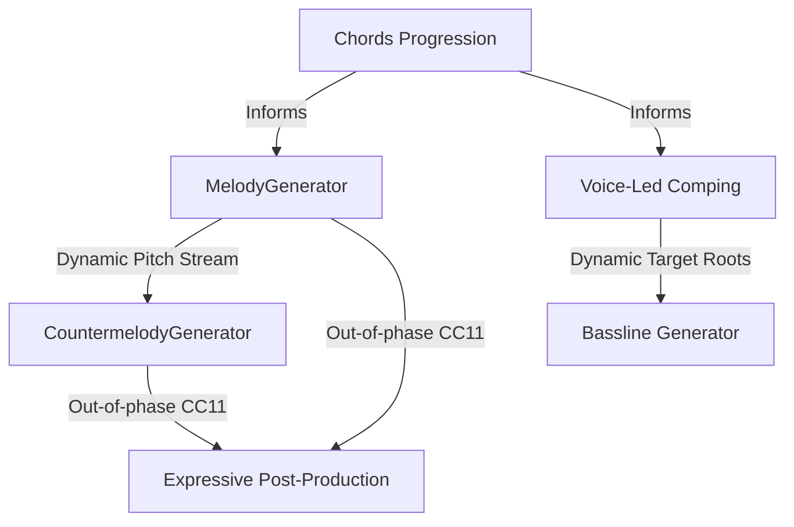

# Technical Handover Brief: Melodic & Contrapuntal Refinement

This document details the current architectural implementation of the lead solo melody and countermelody in [demo_melody_comping.py](file:///Volumes/External/Code/Melodica/scripts/demo_melody_comping.py), outlining concrete areas for the **Senior Developer/Composer** to further refine the musical phrasing, harmonic voice leading, and dynamic expression.

---

## 🏗️ Architectural Overview

The coordination engine manages 5 concurrent tracks over a 96-beat arrangement:
1. **Lead Solo (`lead`)**: Trombone (GM 57) or similar warm wind/lead synth solo, utilizing the advanced `MelodyGenerator` (`melodica/generators/melody.py`).
2. **Countermelody (`counter`)**: Alto sax (GM 65) or secondary wind voice, generated via `CountermelodyGenerator` (`melodica/generators/countermelody.py`).
3. **Chords (`piano`)**: Rhodes/Piano (GM 5) voice-led jazz chords with rich extensions.
4. **Bass (`bass`)**: Acoustic/slap bass (GM 33) dynamically sync'd to chords and melody anchors.
5. **Drums (`drums`)**: Humanized brushed swing and hard bop grooves (GM 117).



---

## 🎼 Current Section-by-Section Configurations

The arrangement is divided into distinct structural sections to demonstrate diverse soloist interactions and dynamic energy contours:

### 1. Section B: Verse (Beats 16.0 - 48.0) — Thematic Vocal Hook
*   **Melodic Goal**: Lyrical, soulful minor-pentatonic vocal mimicry that is highly memorable.
*   **Handcrafted Motif**: 
    - Pitches: `[69, 72, 74, 72, 69]` (A4, C5, D5, C5, A4) — D minor pentatonic hook.
    - Rhythm Durations: `[0.75, 0.25, 1.0, 0.5, 0.5]` (syncopated dotted-quarter pattern).
    - Structural Rhythm Motif: `[1.5, 0.5, 1.0, 1.0]` (guides phrasing outside the hook).
*   **Parameters**:
    - `phrase_length=8.0` (creates 2-bar call-and-response phrase boundaries).
    - `phrase_contour="arch"` (arched contour peaks).
    - `motif_probability=0.8` (high motif sequencing, transposition, and variation).
    - `ornament_probability=0.25` (adds expressive vocal melismas and grace notes).
    - `drama_shape="tension_release"` (organic swell and release dynamic curve).
*   **Countermelody**: 
    - Register: Alto sax range `50` to `68` underneath the Trombone.
    - `motion_preference="mixed"` (tasteful blend of contrary, parallel, and oblique motion).
    - Rhythm: `MarkovRhythmGenerator(style="swing", syncopation=0.25)` (clean syncopated swing counter-phrases).

### 2. Section C: Bridge (Beats 48.0 - 80.0) — High-Energy Virtuoso Solo
*   **Melodic Goal**: Modulates to D Dorian for bright, fast-paced jazz-fusion virtuosity.
*   **Parameters**:
    - `phrase_length=4.0` (shorter, active solo phrases).
    - `phrase_contour="rise"` (ascending register building intense melodic tension).
    - `density=0.65`, `syncopation=0.3` (dense, syncopated runs).
    - `harmony_note_probability=0.68`, `steps_probability=0.6` (colorful jazz extensions, scalar runs).
    - `drama_shape="epic"` (epic building climax with subdivision accelerandos to triplets and fast runs).
*   **Countermelody**:
    - Register: active alto sax range `48` to `65`.
    - `motion_preference="contrary"` (contrary motion for maximum contrapuntal separation).
    - Rhythm: `MarkovRhythmGenerator(style="swing", syncopation=0.3)` (active swing accents).

### 3. Section D: Outro (Beats 80.0 - 96.0) — Spacious Ambient Farewell
*   **Melodic Goal**: Deep modal-ambient trumpet/sax fading away slowly over drone-like chords.
*   **Parameters**:
    - `phrase_length=16.0` (extremely wide, breathing phrase boundaries).
    - `phrase_contour="flat"` (stable register for ambient drone vibe).
    - `density=0.25` (minimal notes).
    - `phrase_rest_probability=0.4` (adds dramatic breath pauses).
    - `ornament_probability=0.15` (simple closing ornaments).
*   **Countermelody**:
    - Register: quiet saxophone range `50` to `68`.
    - `motion_preference="oblique"` (sax holds spacious drone notes while trombone solo phrases move, resolving cleanly).

---

## 🎯 Specific Areas for Senior Developer/Composer Refinement

To elevate this arrangement from a premium procedural draft to an industry-grade jazz production, focus on the following core areas:

### 1. Phrasing Contours & Melodic Curves
*   **Current State**: We use `"arch"` in the verse, `"rise"` in the bridge, and `"flat"` in the outro.
*   **Refinement Opportunities**:
    - Experiment with other contour shapes in `MelodyGenerator` (e.g., `"rise_fall"` or `"spiral"`) to see how they impact vocal fluidity in Section B.
    - Fine-tune the `climax` parameter in `MelodyGenerator` (which currently defaults to `"auto"`) to anchor the melodic peak at exact beats or pitches (e.g., matching the V7 turnaround chord at beat 46.0).

### 2. Micro-Timing & Laid-back Swing Grids
*   **Current State**: Drum patterns already feature custom laid-back delay offsets (`laid_back_delay = 0.015`) to drag the snare/ride behind the beat for an authentic jazz feel.
*   **Refinement Opportunities**:
    - Implement a dynamic micro-timing engine for the solo tracks.
    - Delaying the counterpoint sax slightly behind the lead trombone (e.g., 8–15ms) will create a highly authentic, relaxed "jazz pocket" that avoids sterile, perfectly-quantized MIDI notes.

### 3. Altered Harmony Voice Leading
*   **Current State**: The chord voicing engine in `generate_voice_led_comping` injects basic extensions (7ths, 9ths, 11ths, 13ths):
    ```python
    if c.quality in [Quality.MINOR, Quality.MINOR7]:
        c.extensions.extend([10, 14]) # 7th, 9th
    ```
*   **Refinement Opportunities**:
    - Inject **altered dominant extensions** (e.g., `#9`, `b13`, `b9`) when transitioning to the cadential dominant `V` (A7alt).
    - This will enrich the noir atmosphere and give the soloists more colorful tension tones to target in their scale sweeps.

### 4. Advanced Pitch Detuning (CC 98) in Section D
*   **Current State**: Section D uses static coarse/fine-tuning messages to simulate tape warmth.
*   **Refinement Opportunities**:
    - Automate a slow, dynamic LFO sweep using CC 98 (Fine Tuning) or Pitch Bend for the outro sax.
    - A subtle drift (+/- 15 cents) will create a gorgeous, melancholic, vintage analog tape or weeping horn effect as the song fades out.

### 5. Legato and Breath Integration
*   **Current State**: The post-processor multiplies note durations by `1.08` to simulate legato sustain bleed.
*   **Refinement Opportunities**:
    - Map velocity to MIDI Breath Controller (CC 2) or Expression (CC 11) dynamically.
    - Make sure that note gaps (rests) are preceded by a slight volume dip to mimic a player taking a breath.
