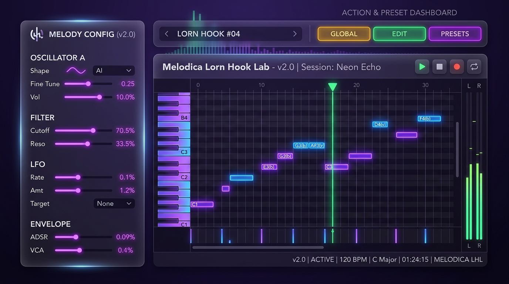

# Melodica Lorn Hook Laboratory (v2.0)

Welcome to the **Lorn Hook Laboratory**, a dark, moody, futuristic glassmorphic workspace designed to generate, optimize, and synthesize melodic hooks.

This tool runs on a **Dual Generative Engine** architecture combining local browser-based algorithms with an advanced Apple MLX deep learning optimization backend running locally on Apple Silicon GPU (Metal).



---

## ⚡ Quick Start & Server Management

A dedicated command-line management utility, `lab`, is located in the root of the workspace.

* **Start both servers** (HTTP server on port 8080, MLX API on port 8081):
  ```bash
  ./lab start
  ```
* **Check status** of the running servers:
  ```bash
  ./lab status
  ```
* **Restart the services**:
  ```bash
  ./lab restart
  ```
* **Stop the servers**:
  ```bash
  ./lab stop
  ```
* **View logs** in real-time:
  ```bash
  ./lab logs          # Show latest lines from both servers
  ./lab logs api      # Follow MLX API server logs (tail -f)
  ```

---

## 🎹 Dual Generative Engines

The dashboard splits generation controls into three distinct categories:

### 1. Apple MLX GPU Engine (Metal-Accelerated)
Optimizes a melody hook on-the-fly by exploring a continuous latent space through a neural decoder network:
* **Generate Hook (`elite=false`):** Runs a fast 50-step optimization over a batch of 8 parallel candidates without post-processing. Good for raw, variable neural outputs.
* **Random Elite (`elite=true`):** Runs a full 300-step curriculum temperature-annealing optimization over a batch of 64 parallel candidates with early stopping at $\ge 95$ fitness. Includes local search refinement to guarantee a perfect 100/100 memorability score.

### 2. Local JS Engine (Browser)
Runs local client-side procedural generation:
* **Generate Hook:** Generates a basic random procedural hook.
* **Generate Elite (95+):** Runs a client-side procedural loop until a hook scoring $\ge 95$ is found.

---

## 🎼 Advanced Features

### 🛡️ Leap-Constrained Resolution Override (`EnforceResolution`)
To guarantee that hooks resolve musically to the key of the track without destroying the melodic contour:
* The last note is forcibly shifted to the nearest stable octave of the scale's tonic (root) or dominant (5th).
* To prevent jarring, large leaps, a soft leap-penalty cost function is applied:
  $$Cost(p) = |p - \text{last.pitch}| + 4.0 \times \max(0, |p - \text{prev.pitch}| - 8)$$
  This guarantees the final note stays within a reasonable musical distance ($\le 8$ semitones) from the 4th note.

### 🔊 Click-Free Synthesizer Envelopes
To eliminate digital pops/clicks during Web Audio synthesizer playback, the engine uses **Duration-Aware ADSR Scheduling**:
* **Long Notes ($>0.15$s):** Traditional ADSR envelope with Attack, Decay, Sustain, and Release ramps.
* **Short Notes ($\le 0.15$s):** Simplified Attack-Release triangle envelope to prevent overlapping timeline schedules.
* **Delayed Stop:** Oscillators are scheduled to stop $0.05$ seconds after the gain envelope reaches zero, letting release tails fade out in absolute silence.

### 🎓 Formal Mathematical Specification
For a complete, mathematically rigorous definition of the system states, operations, and composition pipeline, read the Z-Notation document:
👉 **[Formal Z-Specification (z_notation_model.md)](z_notation_model.md)**
