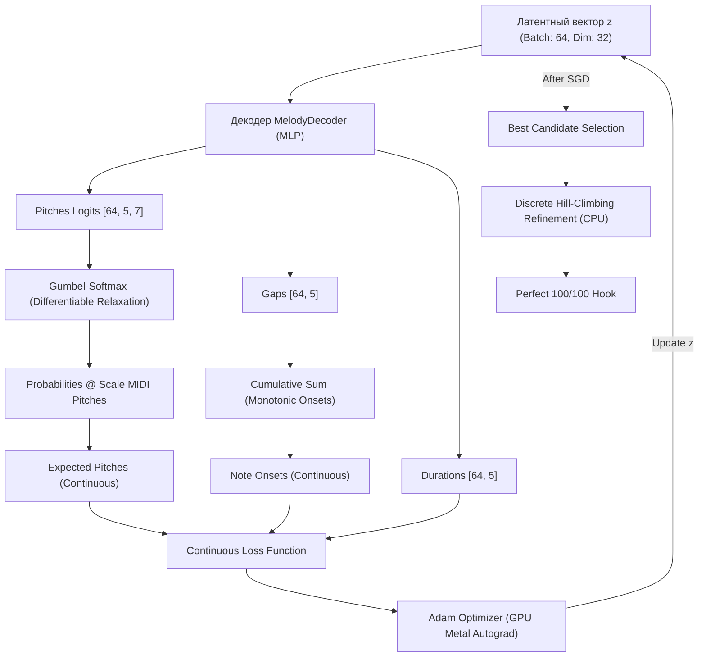

# Архитектурный обзор генератора мелодий Melodica (Apple MLX)

В текущей версии Melodica задача композиции мелодического хука решается не как классический статический инференс предобученной модели, а как **динамический поиск в латентном пространстве (Latent Space Search)** с использованием градиентного спуска на фреймворке **Apple MLX** с аппаратным ускорением GPU Metal.

---

## 1. Архитектурная схема пайплайна

---

## 2. Ключевые компоненты архитектуры

### А. Декодер (`MelodyDecoder`)
Вместо прямой оптимизации дискретных параметров нот оптимизируется **латентный вектор $z$** размерности `32`. Декодер преобразует его в параметры нот:
* **Высоты нот (Pitches):** выходной линейный слой проецирует признаки в матрицу логитов `[num_notes, scale_size]` (5 нот по 7 ступеням гаммы).
* **Сетка времени (Onsets):** декодер прогнозирует временные интервалы (`gaps`) в диапазоне `[0.5, 1.25]` долей; накопительная сумма (`cumsum`) гарантирует, что ноты располагаются строго друг за другом.
* **Длительности (Durations):** прогнозируются независимо в пределах `[0.3, 1.2]` долей.

> [!NOTE]
> Случайно инициализированный декодер вводит гладкое параметрическое отображение из латентного пространства в пространство мелодий, уменьшая число независимых оптимизируемых параметров. Это действует как архитектурный prior, хотя он существенно слабее, чем обученный на данных генератор (в отличие, например, от Deep Image Prior, где сама архитектура свёрточной сети является сильным индуктивным смещением).

---

### Б. Дифференцируемое сэмплирование (Gumbel-Softmax)
Поскольку операция жёсткого выбора ноты `argmax` не дифференцируема, во время обратного прохода применяется релаксация **Gumbel-Softmax**:
$$y = \text{softmax}\left(\frac{\text{logits} + g}{\tau}\right)$$
где $g \sim \text{Gumbel}(0, 1)$ — стохастический шум, $\tau$ — температура. Это позволяет получать непрерывные приближённые градиенты (differentiable relaxation) от дискретного выбора нот к латентному коду — не точные градиенты дискретной операции, а градиенты её гладкой аппроксимации.

---

### В. Curriculum & Annealing (Температурный отжиг)
Оптимизация проходит в 300 шагов с постепенным понижением температуры $\tau$:
1. **Шаги 1–100 ($\tau = 2.0$):** высокая энтропия, свободное исследование латентного пространства.
2. **Шаги 101–200 ($\tau = 1.0$):** сужение поиска вокруг лучших зон.
3. **Шаги 201–300 ($\tau = 0.3$):** распределение логитов становится близким к one-hot (истинный one-hot достигается только через `argmax` или straight-through на инференсе).

---

## 3. Математика функции потерь (Fully Continuous Loss)

### 1. Ритмическая синкопа
$$\text{sync\_soft} = \sum \sigma(20.0 \times (\sin^2(\pi \cdot \text{onset}) - 0.15))$$
$$L_{\text{sync}} = \left(\frac{\text{sync\_soft}}{5} - 0.40\right)^2$$

### 2. Контур мелодии (Step vs Leap Balance)
* **Мягкие шаги:** $\text{steps\_soft} = \sum \sigma(2.5 - |d|) \cdot \sigma(|d| - 0.5)$
* **Мягкие скачки:** $\text{leaps\_soft} = \sum \sigma(|d| - 2.5)$

Целевые показатели: 70% шагов и 30% скачков.

### 3. Разрешение тональности
$$L_{\text{res}} = \min((P_{\text{last}} - 60)^2, (P_{\text{last}} - 67)^2)$$

### 4. Энтропия (регуляризация)
$$L_{\text{entropy}} = \sum p \log(p)$$

---

## 4. Пакетная оптимизация на GPU (Parallel Batching)

1. Создаётся тензор латентных переменных $z$ формы `[64, 32]` со случайным шумом.
2. Весь пакет из 64 мелодий проходит через `MelodyDecoder` и `LossFunction` за один шаг.
3. Каждые 30 итераций подмешивается стохастический шум $Normal(0, 0.05)$ для преодоления седловых точек.
4. В конце CPU оценивает 64 траектории через точную фитнес-функцию и выбирает лучшую.

### Преимущества подхода:
* Батчинг эффективно использует параллелизм GPU Metal на Apple Silicon; стоимость вычислений растет значительно медленнее линейной благодаря пакетной обработке (конкретный выигрыш зависит от размера MLP, батча, памяти и модели чипа).
* Параллельный старт 64 точек значительно повышает вероятность нахождения качественного решения по сравнению с одиночным запуском.

---

## 5. Латентная геометрия

Поскольку оптимизация выполняется в непрерывном пространстве размерности 32, близкие латентные векторы обычно порождают близкие мелодические структуры. Это делает поиск значительно более устойчивым, чем независимая оптимизация каждой ноты, и объясняет, зачем вообще нужен латентный код, а не прямая параметризация нот.

---

## 6. Дискретный локальный «дожим» и Early Stopping

### А. Локальный поиск (Discrete Hill-Climbing)
Continuous relaxation решает глобальную комбинаторную задачу, но иногда промахивается на минорные доли или полутона из-за неточного совпадения суррогатных градиентов с дискретной фитнес-оценкой.
Для преодоления этого барьера после завершения градиентной оптимизации запускается **дискретный локальный поиск (Hill-Climbing)** по лучшим кандидатам:
* Производится итеративный перебор мутаций параметров (изменение ступени высоты, сдвиг начала ноты на $\pm 0.05$ долей, изменение длительности).
* Новые варианты оцениваются через **точную** CPU фитнес-функцию.
* Если мутация увеличивает точный скор, она сохраняется. Это гарантированно закрывает разрыв между 85–95 и 100/100 очками.

### Б. Fitness-aware Early Stopping
Каждые 25 итераций происходит промежуточный просчет дискретной фитнес-оценки для всего батча. Если один из кандидатов достигает порога $\ge 95$ очков, оптимизация немедленно останавливается, кандидат отправляется на локальный дожим и возвращается клиенту. Это сокращает объем вычислений в 3–4 раза на простых тональностях.

---

## Направление развития

Сейчас система представляет собой **decoder-only optimizer** со случайным декодером. Следующий логичный шаг — обучить декодер на большом корпусе MIDI (например, Lakh MIDI Dataset или MAESTRO), после чего во время генерации оптимизировать только латентный вектор. Тогда декодер станет полноценным генеративным prior, а не случайной параметрической функцией, что обычно даёт более музыкально связные мелодии при сохранении возможности навязывать композиционные ограничения через функцию потерь.
