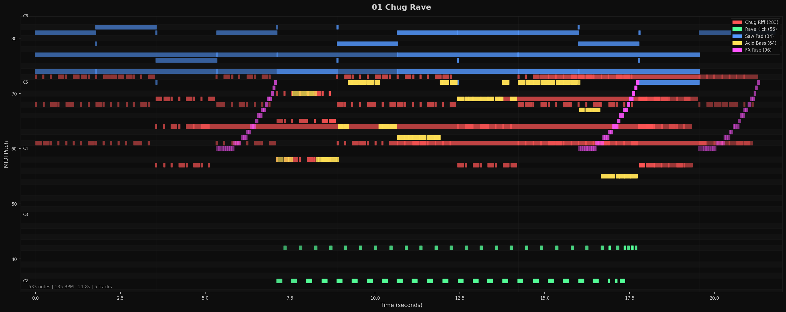
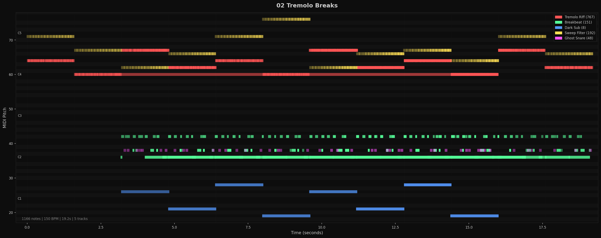
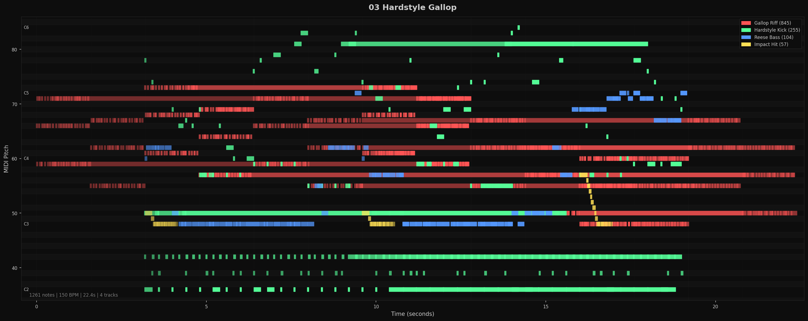
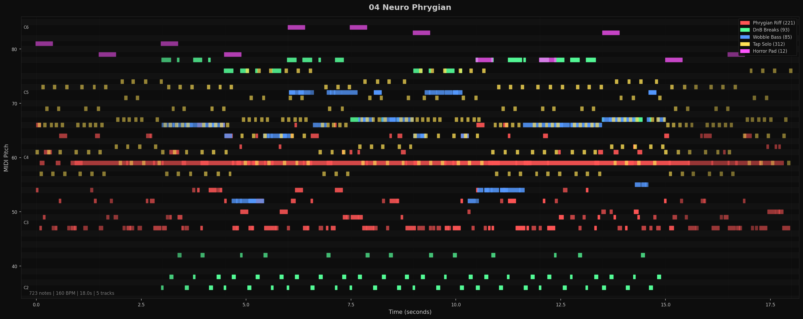
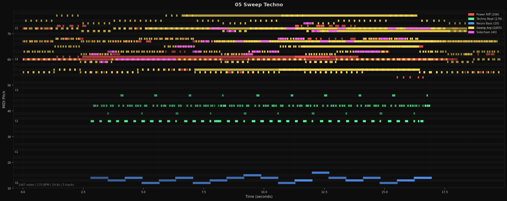
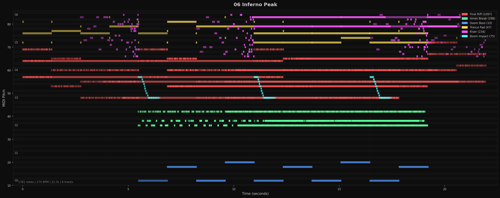

# Piano Roll Analysis

Theme: dark | Files: 6

## 01 Chug Rave

**533 notes** | **135 BPM** | **21.8s** | **5 tracks**

### Overview

```
  A#5 │     ░░░░░░░           ░    ░                       ░                   │
      │░░░░░░     ░     ░░░░░░░    ░░░░░░░░░░░░░░░░░░░░░░░░░░░░░░     ░░░░░░░░░│
      │░░░░░░░░░░░░░░░░░░░░░░░░░░░░░░░░░░░░░░░░░░░░░░░░░░░░░░░░░░░░░░░░        │
      │░░░░░░░░░░░░░░░░░░░░░░░░░░░░░░░░░░░░░░░░░░░░░░░░░░░░░░░░░░░░░░░░██████  │
  A#4 │           ░          ●●▪▪▪██ ▪▪▪▪    ▪▪▪   ▪▪▪▪▪▪▪▪▪    ●░░░░░░     ●  │
      │█████████████████████●●      ███████████▪▪▪▪▪▪▪█████▪▪▪█●●██████████●●  │
      │           █████████●●███████▪▪██▪▪████████████████████●●██████    ●●   │
      │███████████      ██●●███    ██████▪▪▪▪▪██████████████●●●█████████●●██   │
  A#3 │                 ●●●   ▪▪█▪▪▪▪                      ●●         ●●●      │
      │           ██████                       ███████       ▪▪▪▪██████        │
      │                                                                        │
      │                                                                        │
  A#2 │                                                                        │
      │                                                                        │
      │                       ▓▓▓▓ ▓▓ ▓▓ ▓▓▓▓▓▓▓▓▓ ▓▓ ▓▓▓▓▓▓▓▓▓▓▓              │
      │                       ▓▓▓▓▓▓▓▓▓▓▓▓▓▓▓▓▓▓▓▓▓▓▓▓▓▓▓▓▓▓▓▓▓▓               │
      └────────────────────────────────────────────────────────────────────────┘
       0s                                    21.8s
```

### Tracks

| Track | Shape | Notes | Pitch | Duration | Vel | Density |
|-------|-------|------:|-------|----------|-----|--------:|
| Chug Riff | zigzag / wave | 283 | A3–C#5 (16) | <0.01s–7.3s (avg 0.19s) | 29–125 (66) | 13.6 n/s |
| Rave Kick | zigzag / wave | 56 | C2–F#2 (6) | <0.01s–0.13s (avg 0.08s) | 57–125 (106) | 5.3 n/s |
| Saw Pad | staircase | 34 | C5–A#5 (10) | <0.01s–5.3s (avg 1.8s) | 40–102 (74) | 1.7 n/s |
| Acid Bass | mixed pattern | 64 | G3–C5 (17) | 0.03s–0.18s (avg 0.14s) | 68–125 (117) | 6.1 n/s |
| FX Rise | scatter | 96 | C4–C5 (12) | 0.02s–0.05s (avg 0.04s) | 7–125 (50) | 6.0 n/s |



---

## 02 Tremolo Breaks

**1166 notes** | **150 BPM** | **19.2s** | **5 tracks**

### Overview

```
  E5 │                             ▪▪▪▪▪▪▪                                    │
      │                                                                        │
      │▪▪▪▪▪▪                 ▪▪▪▪▪▪▪                             ▪▪▪▪▪▪▪      │
      │     ▪▪▪▪▪▪▪█████▪▪▪▪▪▪▪           ██████▪▪▪▪▪▪▪▪▪▪▪▪▪     ██████▪▪▪▪▪▪ │
  C#4 │██████     ▪▪▪▪▪▪▪████████████     ▪▪▪▪▪▪▪███████████▪▪▪▪▪▪▪     ███████│
      │     ███████████████████████████████████████████████████████            │
      │                                                                        │
      │                                                                        │
  A#2 │                                                                        │
      │           ▓▓▓▓▓▓▓▓▓▓▓▓▓▓▓▓▓▓▓▓▓▓▓▓▓▓▓▓▓ ▓▓▓▓▓▓▓▓▓▓▓▓▓▓▓▓▓▓▓▓▓▓▓▓▓▓▓▓▓  │
      │            ●●●▓●●●●●▓▓●●●●●▓●●● ▓▓●●▓●●● ▓● ●●●●▓●●● ●●●●● ▓●●●● ●▓●▓● │
      │           ▓  ▓▓▓▓▓▓▓▓▓▓▓▓▓▓▓▓▓▓▓▓▓▓▓▓▓▓▓▓▓▓▓▓▓▓▓▓▓▓▓▓▓▓▓▓▓▓▓▓▓▓▓▓▓▓▓▓▓ │
  G1 │                                                                        │
      │                       ░░░░░░░                 ░░░░░░░                  │
      │           ░░░░░░░                 ░░░░░░░                              │
      │                 ░░░░░░░     ░░░░░░░     ░░░░░░░     ░░░░░░░            │
      └────────────────────────────────────────────────────────────────────────┘
       0s                                    19.2s
```

### Tracks

| Track | Shape | Notes | Pitch | Duration | Vel | Density |
|-------|-------|------:|-------|----------|-----|--------:|
| Tremolo Riff | scatter | 767 | C4–G4 (7) | <0.01s–4.9s (avg 0.03s) | 48–125 (85) | 40.0 n/s |
| Breakbeat | staircase | 151 | C2–F#2 (6) | <0.01s–0.92s (avg 0.15s) | 29–125 (90) | 9.5 n/s |
| Dark Sub | zigzag / wave | 8 | G0–E1 (9) | 1.6s–1.6s (avg 1.6s) | 48–113 (88) | 0.7 n/s |
| Sweep Filter | mixed pattern | 192 | D4–E5 (14) | 0.06s–0.10s (avg 0.09s) | 2–96 (33) | 10.1 n/s |
| Ghost Snare | rhythmic dots | 48 | D2–D2 (0) | 0.05s–0.05s (avg 0.05s) | 15–50 (33) | 3.0 n/s |



---

## 03 Hardstyle Gallop

**1261 notes** | **150 BPM** | **22.4s** | **4 tracks**

### Overview

```
  C6 │                                            ▓▓                          │
      │                        ▓▓  ▓▓▓▓▓▓▓▓▓▓▓▓▓▓▓▓▓▓▓▓▓▓▓▓▓▓▓▓▓▓              │
      │          ▓         ▓ ▓    ▓      ▓        ▓    ▓▓     ▓▓               │
      │                    ▓     ▓                              ▓              │
  C5 │          ▓██████████████████░░▓█▓██   ▓▓▓    ▓       ░░░▓  ░           │
      │████████████▓██▓███████████████▓▓█████▓▓▓         ░░░░░░░░▓▓▓           │
      │██████████   ▓▓  ▓  ████████████████▓▓█████████████▓█████░░░░█████      │
      │     █████░░░  ██▓▓██    ██░░░░██████▓▓█████████░████▓█████████████████ │
  B3 │██████████░███████▓▓▓▓▓█▓█████░████▓▓█▓▓█         ████▓▓█▓▓▓▓           │
      │               ▓▓▓▓▓███████████░░░░█████████████░░▪▪█▓▓████████████████ │
      │     ██████              ▓░▓▓▓██████████▓▓▓▓▓██████▪██████████████      │
      │          ▪▓░░▓▓▓▓▓▓▓▓▓▓▓▓░░▓▓▪▪▓▓▓▓▓▓▓▓▓▓▓▓░░░░░▓█▪▪███████████████████│
  A#2 │          ▪▪▪▪░░░░░░░░░░░░     ▪▪▪░░░░░░░░░░░░    ██▪▪███████           │
      │                                                                        │
      │          ▓▓▓▓▓▓▓▓▓▓▓▓▓▓▓▓▓▓▓▓▓▓▓▓▓▓▓▓▓▓▓▓▓▓▓▓▓▓▓▓▓▓▓▓▓▓▓▓▓▓▓           │
      │          ▓▓▓▓ ▓▓▓▓▓▓▓▓ ▓▓▓▓▓▓▓▓▓▓▓▓▓▓▓▓▓▓▓▓▓▓▓▓▓▓▓▓▓▓▓▓▓▓▓▓▓           │
      └────────────────────────────────────────────────────────────────────────┘
       0s                                    22.4s
```

### Tracks

| Track | Shape | Notes | Pitch | Duration | Vel | Density |
|-------|-------|------:|-------|----------|-----|--------:|
| Gallop Riff | zigzag / wave | 845 | C3–C#5 (25) | <0.01s–8.1s (avg 0.14s) | 22–125 (62) | 38.0 n/s |
| Hardstyle Kick | zigzag / wave | 255 | C2–C6 (48) | <0.01s–5.4s (avg 0.20s) | 34–125 (102) | 16.1 n/s |
| Reese Bass | mixed pattern | 104 | C3–C5 (24) | 0.02s–0.16s (avg 0.13s) | 38–125 (101) | 6.6 n/s |
| Impact Hit | scatter | 57 | C3–A3 (9) | <0.01s–0.20s (avg 0.04s) | 29–113 (64) | 4.2 n/s |



---

## 04 Neuro Phrygian

**723 notes** | **160 BPM** | **18.0s** | **5 tracks**

### Overview

```
  C6 │                       ●●●   ●●●                                        │
      │●●         ●●●                     ●●                ●●                 │
      │     ●●●   ▓▓▓▓▓▓●●●   ▓▓▓▓ ▓            ●● ▓▓ ●●▓▓▓▓      ●●    ●●     │
      │                 ▓▓▪▪▪▪▪▪▪         ▓▪▪▪▪▪▪▪                        ▪▪▪▪▪│
  C5 │▪▪▪ ▪▪▪▪▪▪▪▪▪▪▪ ▪▪▪    ░░░░▪▪▪▪░▪▪▪ ░░░░   ▪▪▪ ▪▪▪▪▪▪▪▪▪▪░▪▪▪▪▪▪▪▪      │
      │▪▪▪ ▪▪  ▪▪  ▪▪  ▪▪  ▪▪ ▪▪▪ ▪▪  ▪▪ ▪▪▪▪  ▪▪ ▪▪▪ ▪▪  ▪▪ ▪▪▪ ▪ ▪▪ ▪▪▪ ▪▪   │
      │▪▪▪▪▪▪▪▪▪▪ ▪▪▪▪▪▪▪▪▪▪▪ ▪▪▪▪▪▪▪▪▪▪░▪▪▪▪▪▪▪▪█▪▪▪▪▪▪▪▪▪▪░▪▪▪▪▪▪▪▪▪▪▪▪▪▪▪▪▪ │
      │  █  █ ▪▪▪█▪     ░░▪▪▪▪▪▪▪█   ▪▪▪█▪▪▪▪ ▪▪▪  █  ██     ▪▪▪▪▪█  ██  ▪▪▪█▪ │
  B3 │▪▪▪▪▪▪▪▪▪▪▪▪▪▪▪▪▪▪█▪▪▪█▪▪▪▪▪▪█▪▪▪▪▪▪▪▪▪▪▪▪▪█▪▪▪▪▪█▪▪▪█▪▪▪█▪▪▪▪▪█▪▪▪▪▪▪▪ │
      │▪▪▪ ▪▪▪     ▪▪▪▪ ▪▪       ▪▪▪▪             ▪▪▪▪▪▪▪▪▪▪▪     ▪▪▪ ▪▪▪      │
      │█ █  ███  ██  ████░░░░  ██  █   ███    █░░░░░░ ███ █    ░░ ██ █   █     │
      │█     ██    ██     █  ██    ███   █     █        ██████ █ ████  █   ███ │
  A#2 │███████ ██ █████  █ ████ ████ █████████████  ████  ██ ██████ ████████ █ │
      │                                                                        │
      │             ▓ ▓   ▓ ▓     ▓   ▓ ▓  ▓▓ ▓  ▓▓    ▓  ▓    ▓▓              │
      │           ▓▓ ▓ ▓▓▓▓▓ ▓▓▓▓▓ ▓▓▓▓▓▓▓▓▓▓▓▓▓▓▓▓▓▓▓▓▓▓▓▓▓▓▓▓▓▓▓             │
      └────────────────────────────────────────────────────────────────────────┘
       0s                                    18.0s
```

### Tracks

| Track | Shape | Notes | Pitch | Duration | Vel | Density |
|-------|-------|------:|-------|----------|-----|--------:|
| Phrygian Riff | zigzag / wave | 221 | B2–F#4 (19) | <0.01s–1.2s (avg 0.13s) | 32–125 (84) | 12.4 n/s |
| DnB Breaks | zigzag / wave | 93 | C2–F#5 (42) | <0.01s–0.30s (avg 0.07s) | 55–125 (111) | 7.9 n/s |
| Wobble Bass | mixed pattern | 85 | E3–C5 (20) | 0.03s–0.15s (avg 0.12s) | 56–125 (99) | 7.2 n/s |
| Tap Solo | zigzag / wave | 312 | A3–E5 (19) | 0.02s–0.04s (avg 0.04s) | 27–91 (61) | 17.4 n/s |
| Horror Pad | staircase | 12 | F#5–C6 (6) | 0.38s–0.38s (avg 0.38s) | 32–84 (66) | 0.7 n/s |



---

## 05 Sweep Techno

**1447 notes** | **170 BPM** | **19.8s** | **5 tracks**

### Overview

```
  F5 │     ▪▪▪▪            ▪▪▪▪▪▪▪▪▪▪▪▪▪▪▪▪▪▪▪▪▪▪▪▪▪▪▪▪▪▪▪▪▪▪▪▪▪▪             │
      │▪▪▪▪▪███▪▪▪▪▪▪▪▪▪▪▪▪▪    ▪▪▪▪▪▪▪▪▪▪▪▪▪  █●●▪▪▪▪▪▪▪▪▪▪▪▪    ▪▪▪▪▪▪▪▪▪▪▪▪ │
      │▪▪▪▪▪▪▪▪▪▪▪▪▪▪▪▪▪▪▪▪▪▪▪▪▪▪▪●●●●●▪▪▪▪▪▪▪●●▪▪●●●●●●▪▪▪▪▪●●●●●●●▪▪▪▪▪▪▪▪▪▪ │
      │▪▪▪▪▪▪▪▪▪▪▪▪▪▪▪▪▪▪▪▪▪▪●●●●●●▪▪▪●●▪▪●●●●●●●▪▪●●▪▪●●▪▪▪●●●●▪▪▪▪▪▪▪▪▪▪▪▪▪▪ │
  C4 │▪▪▪▪▪▪▪▪▪▪●●●●●●●●●●●●●▪▪●●▪▪▪▪▪●●●●●●▪▪▪▪▪▪▪▪▪▪▪●●●●●▪▪▪▪▪▪▪▪▪▪▪▪▪▪▪▪▪▪│
      │    ▪▪▪▪▪▪▪●●▪   ▪▪▪▪▪▪▪▪▪▪▪▪▪▪▪▪▪▪▪▪▪▪▪▪▪▪▪▪▪▪▪▪▪▪▪▪▪▪▪▪▪▪▪   ▪▪▪▪     │
      │▪▪▪▪▪   ▪▪▪▪▪▪▪▪▪▪       ▪▪▪▪▪▪▪▪▪▪▪▪▪▪  ▪▪▪▪▪▪▪▪▪▪    ████▪▪▪▪▪▪▪▪▪▪▪▪ │
      │                                                                        │
  G2 │              ▓    ▓    ▓    ▓    ▓▓   ▓▓   ▓▓    ▓    ▓    ▓           │
      │          ▓▓▓▓▓▓▓▓▓▓▓▓▓▓▓▓▓▓▓▓▓▓▓▓▓▓▓▓▓▓▓▓▓▓▓▓▓▓▓▓▓▓▓▓▓▓▓▓▓▓▓           │
      │          ▓▓▓▓▓▓▓▓▓▓▓▓▓ ▓▓▓▓▓▓▓▓▓ ▓▓▓▓▓▓▓▓▓▓▓▓▓▓▓▓▓▓▓▓▓▓▓▓▓▓            │
      │                                                                        │
  C#1 │                                                                        │
      │                                                                        │
      │                                                                        │
      │          ░░░░░░░░░░░░░░░░░░░░░░░░░░░░░░░░░░░░░░░░░░░░░░░░░░░           │
      └────────────────────────────────────────────────────────────────────────┘
       0s                                    19.8s
```

### Tracks

| Track | Shape | Notes | Pitch | Duration | Vel | Density |
|-------|-------|------:|-------|----------|-----|--------:|
| Power Riff | zigzag / wave | 206 | F3–C#5 (20) | <0.01s–8.8s (avg 0.20s) | 25–112 (64) | 10.6 n/s |
| Techno Beat | staircase | 176 | C2–A#2 (10) | <0.01s–0.11s (avg 0.04s) | 14–125 (72) | 12.5 n/s |
| Neuro Bass | mixed pattern | 20 | C0–E0 (4) | 0.68s–0.71s (avg 0.70s) | 44–112 (78) | 1.5 n/s |
| Sweep Arp | mixed pattern | 1005 | G3–F5 (22) | <0.01s–4.8s (avg 0.07s) | 41–116 (85) | 50.9 n/s |
| Sidechain | staircase | 40 | B3–D5 (15) | 0.32s–0.32s (avg 0.32s) | 51–95 (80) | 2.9 n/s |



---

## 06 Inferno Peak

**1761 notes** | **175 BPM** | **22.3s** | **6 tracks**

### Overview

```
  C6 │               ● ●             ●●●                   ●●      ●●● ●●  ●  │
      │▪   ▪   ●● ●●●●●●●   ▪▪▪▪▪▪●●●▪● ●●●●●●●●●●●●●●●●●●●●●●●●●●●●●●●●●●●●●▪▪│
      │▪▪▪▪▪▪▪▪▪●●●▪●●▪●●▪▪▪▪    ●▪▪●●●●●●●●●●●●●●●●●●●●●●●●●●●●●●●●●●●●●●●●●  │
      │▪   ▪   ▪●●●●●●●●▪   ▪    ▪●●●● ●●●▪▪▪▪▪▪▪▪▪▪▪▪▪▪▪▪▪●▪▪●●●●●●●●●█●●● ●  │
  F4 │█████████  ●  ●●●●████████●●  ● ●●●██████████████████●██●●█●●██●●██●●●  │
      │██████████████████████████████████████████████████████████████████████  │
      │█████████████████◆◆███████████████◆◆████            ◆◆                  │
      │    ██████████████◆████████████████◆◆████████████████◆████████████████  │
  A#2 │        ██████████◆◆◆███████████████◆◆◆██████████████◆◆◆█               │
      │                 ▓▓▓▓▓▓▓▓▓▓▓▓▓▓▓▓▓▓▓▓▓▓▓▓▓▓▓▓▓▓▓▓▓▓▓▓▓▓▓▓▓▓▓▓           │
      │                 ▓▓▓▓▓▓▓▓▓▓▓▓▓▓▓▓▓▓▓▓▓▓▓▓▓▓▓▓▓▓▓▓▓▓▓▓▓▓▓▓▓▓▓▓▓          │
      │                                                                        │
  D#1 │                                                                        │
      │                                                                        │
      │                     ░░░░░░   ░░░░░    ░░░░░    ░░░░░   ░░░░░░          │
      │                 ░░░░░    ░░░░░   ░░░░░░   ░░░░░░   ░░░░░               │
      └────────────────────────────────────────────────────────────────────────┘
       0s                                    22.3s
```

### Tracks

| Track | Shape | Notes | Pitch | Duration | Vel | Density |
|-------|-------|------:|-------|----------|-----|--------:|
| Final Riff | zigzag / wave | 1097 | C3–C5 (24) | <0.01s–4.1s (avg 0.10s) | 22–110 (59) | 50.0 n/s |
| Amen Break | staircase | 298 | C2–F#2 (6) | <0.01s–0.43s (avg 0.12s) | 34–125 (89) | 22.3 n/s |
| Doom Bass | zigzag / wave | 10 | C0–G#0 (8) | 1.4s–1.4s (avg 1.4s) | 44–86 (79) | 0.8 n/s |
| Trance Pad | zigzag / wave | 47 | C5–B5 (11) | <0.01s–2.8s (avg 0.65s) | 18–82 (62) | 2.3 n/s |
| Riser | zigzag / wave | 234 | F#4–C6 (18) | <0.01s–6.5s (avg 0.13s) | 10–108 (61) | 12.2 n/s |
| Boom Impact | scatter | 75 | C3–A3 (9) | <0.01s–0.17s (avg 0.04s) | 18–94 (54) | 6.3 n/s |



---
